<style>

/* ===== Fullscreen slide ===== */

slides > slide {
  width: 100vw !important;
  height: 100vh !important;

  left: 50% !important;
  top: 50% !important;

  margin-left: -50vw !important;
  margin-top: -50vh !important;
}

/* ===== Cover background ===== */

.title-slide {
  background-image: url("plots/cover_bg.png");
  background-size: cover;
  background-position: center;
}

/* ===== White transparent title box ===== */

.title-slide hgroup {
  background: rgba(255,255,255,0.82);

  padding: 34px;

  border-radius: 20px;

  width: 58%;

  margin-left: 60px;

  margin-top: 140px;
}

/* ===== Title styles ===== */

.title-slide h1 {
  color: #222 !important;
  font-size: 58px !important;
  font-weight: 700;
}

.title-slide h2,
.title-slide h3 {
  color: #444 !important;
}

/* ===== Remove outer scroll ===== */

body {
  overflow: hidden !important;
}

/* ===== Force black text everywhere ===== */

slides > slide {
  color: #111 !important;
}

slides > slide p,
slides > slide li,
slides > slide td,
slides > slide th,
slides > slide span,
slides > slide div {
  color: #111 !important;
}

/* Preserve intentional colours (red fatal, blue headers, white-on-blue) */
slides > slide [style*="color:#d62728"],
slides > slide [style*="color: #d62728"] { color: #d62728 !important; }
slides > slide [style*="color:white"],
slides > slide [style*="color: white"]   { color: white !important; }
slides > slide [style*="color:#ff7f0e"],
slides > slide [style*="color: #ff7f0e"] { color: #ff7f0e !important; }
slides > slide [style*="color:#2ca02c"],
slides > slide [style*="color: #2ca02c"] { color: #2ca02c !important; }

/* ===== Responsive font size — scales with viewport width ===== */
/* Laptop  (<1600px): clamp(12px, 1.25vw, 20px) => 16px @ 1280 | 18px @ 1440 */
/* Desktop (>=1600px): clamp(20px, 1.35vw, 26px) => 22px @ 1600 | 26px @ 1920 */

slides > slide p,
slides > slide li,
slides > slide td,
slides > slide th {
  font-size: clamp(12px, 1.25vw, 20px) !important;
}

/* ===== Global image cap — prevents any image overflowing slide on any screen ===== */
/* 42vh = ~336px on 800px laptop | ~454px on 1080p | ~605px on 1440p             */
slides > slide > article img {
  max-height: 42vh !important;
  width: auto !important;
  max-width: 100% !important;
  display: block;
}

/* ===== Intro paragraphs above image grids stay compact on all screens ===== */
slides > slide > article > p {
  margin-bottom: 6px !important;
}

/* ===== Large screen (>=1600px): boost font size ===== */
@media (min-width: 1600px) {
  slides > slide p,
  slides > slide li,
  slides > slide td,
  slides > slide th {
    font-size: clamp(20px, 1.35vw, 26px) !important;
  }
}

/* ===== Slide 9: make outer container fill slide height so tables spread out == */
.slide9-outer {
  height: 78vh;
  justify-content: space-evenly !important;
}

/* ===== Slide 21: allow left panel to scroll if it still overflows on tiny screens == */
.slide21-left {
  overflow-y: auto;
  max-height: 82vh;
}

/* Three-column callout boxes fill row evenly */
slides > slide div[style*="flex:0 0 30%"] {
  flex: 1 1 0% !important;
  min-width: 0;
}

/* Callout box rows: keep items at content height, never stretch tall */
slides > slide div[style*="display:flex"][style*="gap:24px"],
slides > slide div[style*="display:flex"][style*="gap:20px"] {
  align-items: flex-start !important;
}

</style>

```{r setup, include=FALSE}

knitr::opts_chunk$set(

  echo = FALSE,

  warning = FALSE,

  message = FALSE

)


library(ggplot2)
library(dplyr)
library(readr)
library(forcats)
library(scales)
library(knitr)
library(kableExtra)
library(tidyr)
library(flextable)
```

```{r load-data, include=FALSE}
df_raw <- read_csv("nsw_road_crash_merged_2020_2024.csv", show_col_types = FALSE)

df_raw <- df_raw %>%
  rename(severity = `Degree of crash`) %>%
  mutate(severity = factor(severity,
    levels = c("Fatal", "Injury", "Non-casualty (towaway)"),
    labels = c("Fatal", "Injury", "Non-casualty")))
```

## Research Question & Motivation

<div style="display:flex; align-items:flex-start; gap:30px;">
<div style="flex:0 0 55%;">

**Research Question:**

> Given environmental conditions (weather, lighting, road surface, speed limit) and traffic unit characteristics (TU type, manoeuvre, number of units), can we predict NSW road crash severity **(Fatal / Injury / Non-casualty)**? A three-class classification problem.

**Why this matters:**

- NSW recorded **340 road fatalities in 2024**; over two-thirds in regional areas *(TfNSW, 2025)*
- Fatal crashes are only **~1.4%** of all records - a severe class imbalance that naive models simply ignore
- Environmental and traffic conditions are knowable *at the time of the crash*, making real-time prediction feasible
- A robust model provides actionable intelligence across multiple decision-making contexts

</div>
<div style="flex:0 0 40%;">

**Stakeholder value:**

| Stakeholder | Application |
|:------------|:------------|
| **Traffic Authorities** | Target speed limits and road design in high-risk corridors |
| **Emergency Responders** | Dispatch resources proportional to predicted severity before on-scene confirmation |
| **Policymakers & Insurers** | Evidence-based road safety policy and risk-adjusted pricing |

<p style="font-size:12px; margin-top:10px; background:#eaf3fb; padding:8px; border-left:3px solid #2E74B5;">
The core challenge: <b>Fatal crashes are rare</b> (~1.4%) but highest-consequence. Standard accuracy metrics fail here - we need models and evaluation that explicitly prioritise the minority class.
</p>
</div>
</div>

## EDA & Data Understanding: Dataset Overview

```{r dataset-overview-robert, echo=FALSE, message=FALSE, warning=FALSE}
total_records <- nrow(df_raw)
total_vars    <- ncol(df_raw)
class_counts  <- table(df_raw$severity)
class_props   <- round(prop.table(class_counts) * 100, 1)

overview <- data.frame(
  Item = c(
    "Time Period",
    "Data Sources",
    "Merge Key",
    "Total Records",
    "Total Variables",
    "Target Variable",
    "Fatal",
    "Injury",
    "Non-casualty"
  ),
  Detail = c(
    "2020 - 2024",
    "CRASH.xlsx + TRAFFIC UNIT.xlsx (TfNSW via data.gov.au)",
    "Crash ID (left join)",
    format(total_records, big.mark = ","),
    as.character(total_vars),
    "Degree of Crash (3-class classification)",
    paste0(format(class_counts["Fatal"], big.mark=","), 
           " (", class_props["Fatal"], "%)"),
    paste0(format(class_counts["Injury"], big.mark=","), 
           " (", class_props["Injury"], "%)"),
    paste0(format(class_counts["Non-casualty"], big.mark=","), 
           " (", class_props["Non-casualty"], "%)")
  )
)

ft <- flextable(overview) |>
  set_header_labels(Item = "Item", Detail = "Detail") |>
  theme_vanilla() |>
  bold(j = 1) |>
  bold(part = "header") |>
  bg(i = c(2, 4, 6), bg = "#f5f5f5") |>
  color(i = 7, j = 2, color = "#d62728") |>
  color(i = 8, j = 2, color = "#ff7f0e") |>
  color(i = 9, j = 2, color = "#2ca02c") |>
  fontsize(size = 16, part = "all") |>
  fontsize(size = 18, part = "header") |>
  padding(padding = 8, part = "all") |>
  set_table_properties(width = 0.80, layout = "autofit") |>
  align(align = "center", part = "all") |>
  autofit()
ft
```

<p style="font-size:13px; text-align:center; margin-top:12px; color:#111;">
The merged dataset combines crash-level environmental conditions with traffic unit vehicle data, giving us both <b>where</b> a crash happened and <b>who</b> was involved. 170,962 records spanning 5 years provide robust signal for modelling, but the extreme class imbalance (Fatal = 1.4%) demands careful handling throughout.
</p>

## EDA & Data Understanding: Class Imbalance

<div style="display:flex; align-items:center; gap:22px; width:100%; height:74vh;">
<div style="flex:1 1 55%; min-width:0;">
```{r class-imbalance-robert, echo=FALSE, message=FALSE, warning=FALSE, fig.width=7, fig.height=5, out.width="100%"}

class_dist <- df_raw %>%
  count(severity) %>%
  mutate(
    proportion = round(n / sum(n) * 100, 1),
    label = paste0(proportion, "%\n(n=", format(n, big.mark=","), ")")
  )

ggplot(class_dist,
       aes(x = severity, y = proportion, fill = severity)) +
  geom_bar(stat = "identity", width = 0.6) +
  geom_text(
    aes(label = label),
    vjust = -0.3,
    size  = 4,
    fontface = "bold"
  ) +
  scale_fill_manual(values = c(
    "Fatal"        = "#d62728",
    "Injury"       = "#ff7f0e",
    "Non-casualty" = "#2ca02c"
  )) +
  scale_y_continuous(limits = c(0, 75)) +
  labs(
    title    = "Class Distribution (2020-2024)",
    subtitle = "Fatal crashes severely underrepresented",
    x = "Severity Class",
    y = "Proportion (%)"
  ) +
  theme_minimal(base_size = 11) +
  theme(legend.position = "none")
```
</div>
<div style="flex:1 1 42%; min-width:0;">

<table style="width:100%; border-collapse:collapse; table-layout:fixed;">
<colgroup><col style="width:40%"><col style="width:60%"></colgroup>
<thead>
<tr style="background:#2E74B5; color:white;">
  <th style="padding:6px 10px; text-align:left; color:white; word-wrap:break-word;">Issue / Decision</th>
  <th style="padding:6px 10px; text-align:left; color:white; word-wrap:break-word;">Detail</th>
</tr>
</thead>
<tbody>
  <tr><td style="padding:5px 10px; word-wrap:break-word;"><b>Class imbalance</b></td><td style="padding:5px 10px; word-wrap:break-word;">Fatal only ~1.4% of all crashes</td></tr>
  <tr style="background:#f5f5f5;"><td style="padding:5px 10px; word-wrap:break-word;"><b>Risk of naive models</b></td><td style="padding:5px 10px; word-wrap:break-word;">Accuracy-maximising models ignore Fatal entirely</td></tr>
  <tr><td style="padding:5px 10px; word-wrap:break-word;"><b>Primary strategy</b></td><td style="padding:5px 10px; word-wrap:break-word;">Random undersampling: Injury and Non-casualty capped at 15k rows; all Fatal rows retained (~31,500 total)</td></tr>
  <tr style="background:#f5f5f5;"><td style="padding:5px 10px; word-wrap:break-word;"><b>Additional corrections</b></td><td style="padding:5px 10px; word-wrap:break-word;">Class weights (DT/RF/XGBoost); SMOTE inside CV folds (LR/NB only)</td></tr>
  <tr><td style="padding:5px 10px; word-wrap:break-word;"><b>Primary metrics</b></td><td style="padding:5px 10px; word-wrap:break-word;">Macro-F1 and Fatal Recall (target >= 0.50)</td></tr>
</tbody>
</table>

</div>
</div>
## EDA & Data Understanding: Speed vs Severity


<div style="display:flex; justify-content:center;">
```{r slide-speed, fig.height=4.2, fig.width=8, out.width="95%"}
speed_levels <- c("10 km/h","20 km/h","30 km/h","40 km/h","50 km/h",
                  "60 km/h","70 km/h","80 km/h","90 km/h","100 km/h","110 km/h")

speed_fatal_props <- df_raw %>%
  filter(`Speed limit` %in% speed_levels) %>%
  mutate(`Speed limit` = factor(`Speed limit`, levels = speed_levels)) %>%
  count(`Speed limit`, severity) %>%
  group_by(`Speed limit`) %>%
  mutate(prop = n / sum(n)) %>%
  ungroup()

# Find peak fatal proportion and which speed band it occurs at
fatal_only <- speed_fatal_props %>% filter(severity == "Fatal") %>% arrange(desc(prop))
peak_speed_label <- as.character(fatal_only$`Speed limit`[1])
peak_fatal_pct   <- round(fatal_only$prop[1] * 100, 1)

speed_fatal_props %>%
  ggplot(aes(x = `Speed limit`, y = prop, fill = severity)) +
  geom_col(position = "stack") +
  geom_hline(yintercept = 0.014, linetype = "dashed", colour = "white", linewidth = 0.8) +
  scale_fill_manual(values = c("Fatal" = "#d62728", "Injury" = "#ff7f0e", "Non-casualty" = "#2ca02c")) +
  scale_y_continuous(labels = percent_format(accuracy = 1)) +
  labs(title = "Crash Severity Proportion by Speed Limit",
       subtitle = paste0("Fatal proportion peaks at ", peak_speed_label, " (", peak_fatal_pct, "%) - over ",
                         round(peak_fatal_pct / 1.4, 1), "x the ~1.4% baseline\nDashed line = overall Fatal baseline"),
       x = "Speed Limit", y = "Proportion of Crashes", fill = "Severity") +
  theme_minimal(base_size = 13) +
  theme(axis.text.x = element_text(angle = 45, hjust = 1), legend.position = "right")
```
</div>

<div style="font-size:13px; margin-top:8px; display:flex; gap:24px; justify-content:center;">
<div style="background:#fce4e4; border-left:3px solid #d62728; padding:7px 12px; flex:0 0 30%;">
**Fatal proportion peaks at `r peak_speed_label`** (`r peak_fatal_pct`% of crashes at that speed are Fatal) - over `r round(peak_fatal_pct / 1.4, 1)`x the ~1.4% overall baseline. High-speed roads are the single strongest environmental risk factor.
</div>
<div style="background:#eaf3fb; border-left:3px solid #2E74B5; padding:7px 12px; flex:0 0 30%;">
**50-60 km/h zones** dominate crash *volume* (urban traffic), but fatal *proportion* is low - volume and risk are decoupled.
</div>
<div style="background:#f0faf0; border-left:3px solid #2ca02c; padding:7px 12px; flex:0 0 30%;">
**Motivates `speed_band`** feature: grouping ≤50 / 60-80 / 90-100 / >100 captures the non-linear jump in fatal risk.
</div>
</div>

## EDA & Data Understanding: High-Risk Scenarios


```{r slide-highrisk, fig.height=3.8, out.width="95%"}
risk_table <- df_raw %>%
  filter(!is.na(`Speed limit`), !is.na(`Natural lighting`), !is.na(Urbanisation)) %>%
  group_by(`Speed limit`, `Natural lighting`, Urbanisation) %>%
  summarise(
    `Total Crashes` = n(),
    `Fatal %`       = mean(severity == "Fatal"),
    .groups = "drop"
  ) %>%
  filter(`Total Crashes` >= 200) %>%
  arrange(desc(`Fatal %`)) %>%
  slice_head(n = 10) %>%
  mutate(`Fatal %` = scales::percent(`Fatal %`, accuracy = 0.1)) %>%
  rename(`Speed Limit` = `Speed limit`, `Lighting` = `Natural lighting`)

kable(risk_table, align = c("l","l","l","r","r")) %>%
  kable_styling(full_width = TRUE, font_size = 13) %>%
  row_spec(0, bold = TRUE, background = "#2E74B5", color = "white") %>%
  row_spec(1:3, background = "#fce4e4") %>%
  column_spec(5, bold = TRUE, color = "#d62728")
```

<div style="font-size:13px; margin-top:10px; display:flex; gap:20px;">
<div style="background:#fce4e4; border-left:3px solid #d62728; padding:7px 12px; flex:1;">
**Top 3 rows (highlighted)** all share 110 km/h + Dusk/Darkness + Country non-urban. Fatal rates of 6.7-7.8% are 5x the overall baseline of ~1.4%.
</div>
<div style="background:#eaf3fb; border-left:3px solid #2E74B5; padding:7px 12px; flex:1;">
**Feature validation:** All three risk dimensions - speed (`speed_band`), lighting (`is_night`), and location (`Urbanisation`) - are directly captured in our engineered feature set.
</div>
<div style="background:#fff8e1; border-left:3px solid #ff9800; padding:7px 12px; flex:1;">
**Interaction matters:** 100 km/h + Daylight + Rural still yields 5.5% Fatal. Speed alone is not sufficient - the model needs to learn joint combinations.
</div>
</div>

## EDA & Data Understanding: Temporal Patterns

<div style="max-height:72vh; overflow:hidden;">
```{r slide-temporal, fig.height=3.2, fig.width=11, out.width="100%"}
day_levels <- c("Monday","Tuesday","Wednesday","Thursday","Friday","Saturday","Sunday")

df_raw %>%
  mutate(`Day of week of crash` = factor(`Day of week of crash`, levels = day_levels),
         `Two-hour intervals`   = factor(`Two-hour intervals`,
                                          levels = unique(`Two-hour intervals`))) %>%
  group_by(`Day of week of crash`, `Two-hour intervals`) %>%
  summarise(count = n(), .groups = "drop") %>%
  ggplot(aes(x = `Two-hour intervals`, y = `Day of week of crash`, fill = count)) +
  geom_tile(colour = "white", linewidth = 0.4) +
  scale_fill_gradient(low = "#f0f4ff", high = "#1F4E79", labels = comma) +
  labs(title = "Crash Frequency by Day of Week and Two-Hour Interval",
       subtitle = "Morning (7-9 am) and evening (4-6 pm) commute peaks visible on weekdays",
       x = "Two-Hour Interval", y = NULL, fill = "Crash Count") +
  theme_minimal(base_size = 11) +
  theme(axis.text.x = element_text(angle = 40, hjust = 1, size = 9),
        axis.text.y = element_text(size = 10),
        panel.grid = element_blank(),
        plot.title = element_text(size = 13),
        plot.subtitle = element_text(size = 10))
```
</div>

<div style="display:flex; gap:10px; margin-top:6px;">
<div style="background:#eaf3fb; border-left:4px solid #2E74B5; padding:8px 14px; font-size:14px; flex:1;">
**Volume pattern:** Weekday commute hours (07:00-09:00, 16:00-18:00) dominate crash counts, directly motivating <code>is_rush_hour</code> and <code>is_weekend</code> as engineered features.
</div>
<div style="background:#fdf3e3; border-left:4px solid #ff9800; padding:8px 14px; font-size:14px; flex:1;">
**Severity pattern:** Fatal <em>rate</em> (not count) is disproportionately elevated on weekends and late-night hours (22:00-04:00) - lower volume but higher consequence, motivating <code>is_night</code> as a key risk feature.
</div>
</div>

## Data Preprocessing: Pipeline


<p style="font-size:1.3em; font-weight:bold; margin-bottom:14px; color:#1F4E79;">Cleaning and Feature Engineering</p>

1. **Traffic Unit Integration** - Aggregated vehicle-level records per crash into binary flags (`has_motorcycle`, `has_heavy_vehicle`, `has_pedestrian`, `has_cyclist`) via `group_by + summarise + left_join`, enabling crash-level modelling
2. **Feature Removal** - Dropped post-crash leakage columns (injury counts), free-text identifiers, and variables with over 75% missing values; also removed `Degree of crash - detailed` as it is redundant with the target
3. **Imputation** - Rows missing more than 50% of values were removed; remaining gaps filled with `"Unknown"` for categoricals and median for numerics to preserve sample size
4. **Feature Engineering** - Created `is_weekend`, `is_rush_hour`, `is_night`, `is_wet`, and `speed_band` - each directly motivated by EDA findings showing their association with fatal outcomes
5. **Outlier Handling** - Applied NSW geographic coordinate bounds to remove implausible locations; winsorised `Distance` at the 99th percentile to reduce leverage from extreme values

<p style="font-size:1.3em; font-weight:bold; margin-bottom:14px; margin-top:16px; color:#1F4E79;">Modelling Setup</p>

6. **Encoding** - Tree-based models use native R `factor` encoding; KNN and LR use one-hot encoding; rare LGA levels collapsed to `"Other"` to avoid high-cardinality sparsity
7. **Scaling** - Z-score standardisation applied within each training fold for KNN; tree-based models are scale-invariant and require no scaling
8. **Class Imbalance** - Majority classes (Injury, Non-casualty) randomly undersampled to 15,000 rows each, retaining all ~1,500 Fatal rows (`df_train_bal`, ~31,500 rows total); inverse-frequency class weights further applied for DT/RF/XGBoost; SMOTE applied **inside CV folds only** for LR and NB
9. **Train/Test Split** - 2024 data sealed as a temporal holdout; 90/10 stratified split applied to 2020-2023 data; model selection via 5-fold cross-validation on the training set

## Data Preprocessing: Feature Engineering & Class Balancing


<div class="slide9-outer" style="display:flex; flex-direction:column; align-items:center; gap:14px;">

<div style="width:88%;">
<p style="font-size:13px; font-weight:bold; margin-bottom:4px; text-align:center;">Engineered features - all motivated by EDA</p>
<table style="font-size:13px; width:100%; border-collapse:collapse;">
<thead><tr style="background:#2E74B5; color:white;">
  <th style="padding:5px 10px;color:white; text-align:left;">Feature</th>
  <th style="padding:5px 10px;color:white; text-align:left;">Derivation</th>
  <th style="padding:5px 10px;color:white; text-align:left;">EDA motivation</th>
</tr></thead>
<tbody>
  <tr><td style="padding:7px 10px;"><code>speed_band</code></td><td style="padding:7px 10px;">Cut Speed limit: ≤50 / 60-80 / 90-100 / >100</td><td style="padding:7px 10px;">Fatal proportion rises sharply above 100 km/h</td></tr>
  <tr style="background:#f5f5f5;"><td style="padding:7px 10px;"><code>is_night</code></td><td style="padding:7px 10px;">Natural lighting in {Darkness, Dawn, Dusk}</td><td style="padding:7px 10px;">Dark conditions double fatal risk</td></tr>
  <tr><td style="padding:7px 10px;"><code>is_rush_hour</code></td><td style="padding:7px 10px;">Two-hour intervals in {7-9, 16-18}</td><td style="padding:7px 10px;">Commute peaks dominate crash volume</td></tr>
  <tr style="background:#f5f5f5;"><td style="padding:7px 10px;"><code>is_weekend</code></td><td style="padding:7px 10px;">Day of week in Saturday, Sunday</td><td style="padding:7px 10px;">Weekend crashes differ in severity profile</td></tr>
  <tr><td style="padding:7px 10px;"><code>is_wet</code></td><td style="padding:7px 10px;">Surface condition contains "Wet"</td><td style="padding:7px 10px;">Wet roads linked to skidding fatalities</td></tr>
  <tr style="background:#f5f5f5;"><td style="padding:7px 10px;"><code>has_motorcycle</code></td><td style="padding:7px 10px;">TU-level aggregated flag</td><td style="padding:7px 10px;">Motorcyclists over-represented in fatals</td></tr>
  <tr><td style="padding:7px 10px;"><code>has_pedestrian</code></td><td style="padding:7px 10px;">TU-level aggregated flag</td><td style="padding:7px 10px;">Pedestrian crashes nearly always severe</td></tr>
</tbody>
</table>
</div>

<div style="width:88%;">
<p style="font-size:13px; font-weight:bold; margin-bottom:4px; text-align:center;">Handling class imbalance</p>
<table style="font-size:13px; width:100%; border-collapse:collapse;">
<thead><tr style="background:#2E74B5; color:white;">
  <th style="padding:5px 10px;color:white; text-align:left;">Issue</th>
  <th style="padding:5px 10px;color:white; text-align:left;">Strategy</th>
</tr></thead>
<tbody>
  <tr><td style="padding:7px 10px;">Fatal only ~1.4% of crashes</td><td style="padding:7px 10px;">Naive accuracy-maximising models predict majority class only - useless for our goal</td></tr>
  <tr style="background:#f5f5f5;"><td style="padding:7px 10px;">Random undersampling (all models)</td><td style="padding:7px 10px;">Injury and Non-casualty capped at 15,000 rows each; all ~1,500 Fatal rows retained; ratio shifts from 1:47:23 to ~1:10:10</td></tr>
  <tr><td style="padding:7px 10px;">Class weights (DT, RF, XGBoost)</td><td style="padding:7px 10px;">Inverse-frequency weights further penalise Fatal misclassification during loss computation</td></tr>
  <tr style="background:#f5f5f5;"><td style="padding:7px 10px;">SMOTE inside CV folds (LR, NB)</td><td style="padding:7px 10px;">Synthetic oversampling applied within each training fold only - no synthetic data in validation; test set unmodified</td></tr>
  <tr><td style="padding:7px 10px;">Primary metrics</td><td style="padding:7px 10px;">Macro-F1 (equal weight across classes) + Fatal Recall (hard constraint: target ≥ 0.50)</td></tr>
</tbody>
</table>
</div>

</div>

## Model Fitting: Approach & Setup


We implemented six diverse classification models to balance interpretability and predictive power. All models were trained on the same balanced training set (`df_train_bal`, $n \approx 31{,}500$) constructed via random undersampling from the 90% training split, ensuring a fair and consistent comparison across all six models.

| Model | R Package | Imbalance Strategy | Primary Hyperparameter |
|:---|:---|:---|:---|
| **Multinomial LR** | `nnet` | SMOTE (inside CV) | `decay` (L2 Penalty) |
| **Decision Tree** | `rpart` | Class Weights | `cp` (Complexity) |
| **Random Forest** | `randomForest` | Class Weights | `mtry` |
| **XGBoost** | `xgboost` | Class Weights | `nrounds`, `max_depth` |
| **KNN** | `kknn` | Undersampling only | `k` (Neighbors) |
| **Naive Bayes** | `naive_bayes` | SMOTE (inside CV) | `laplace`, `usekernel` |

**Validation Strategy:**
- **Primary Metric:** Macro-F1 (robust to class imbalance)
- **Constraint:** Fatal Recall $\geq$ 0.50 (safety-first approach)
- **Method:** 5-fold Cross-Validation (OOB for Random Forest)

*LR/DT/KNN/NB via `caret` (5-fold CV); RF uses OOB error (CV equivalent); XGBoost fitted directly via `xgb.train()`. All on `df_train_bal`. Primary metric: **Macro-F1**. Hard constraint: **Fatal Recall ≥ 0.50**.*

## Model Fitting: Logistic Regression


Logistic regression served as our **interpretable baseline** model. It helps show how key predictors are associated with crash severity, while also giving us a benchmark for comparing more flexible models.

<div style="display:flex; align-items:flex-start; gap:16px;">
<div style="flex:0 0 52%;">
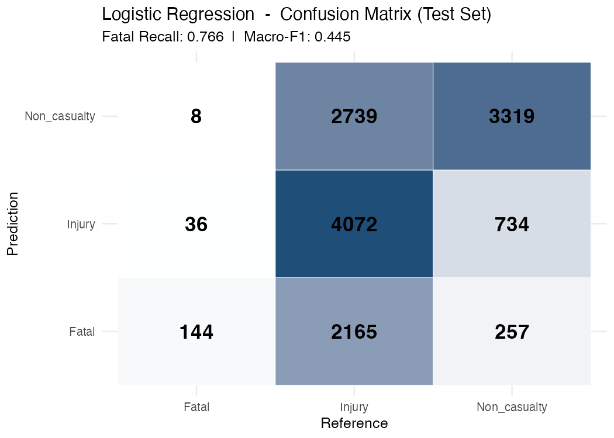
</div>
<div style="flex:0 0 44%;">
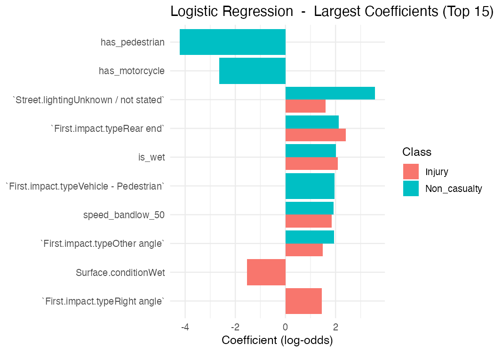

<table style="font-size:12px; width:100%; border-collapse:collapse; margin-top:6px; text-align:left;">
<thead><tr style="background:#2E74B5; color:white;">
  <th style="padding:4px 8px;color:white;">Metric</th><th style="padding:4px 8px;color:white; text-align:right;">Value</th>
</tr></thead>
<tbody>
  <tr><td style="padding:3px 8px;">Macro-F1</td><td style="padding:3px 8px; text-align:right;">0.4446</td></tr>
  <tr style="background:#f5f5f5;"><td style="padding:3px 8px; color:#d62728;"><b>Fatal Recall</b></td><td style="padding:3px 8px; text-align:right; color:#d62728;"><b>0.7660</b></td></tr>
  <tr><td style="padding:3px 8px;">Weighted F1</td><td style="padding:3px 8px; text-align:right;">0.5987</td></tr>
  <tr style="background:#f5f5f5;"><td style="padding:3px 8px;">Kappa</td><td style="padding:3px 8px; text-align:right;">0.2821</td></tr>
</tbody>
</table>

<p style="font-size:11px; text-align:left; margin:0; line-height:1.2; background:#f9f9f9; padding:6px; ">
  <b>Key message:</b> High coefficients for <b>Pedestrians</b>, <b>Night-time</b>, and <b>Non-urban</b> areas prove our baseline LR successfully prioritises the minority class.
</p>
</div>
</div>

## Model Fitting: Decision Tree


Decision Tree was included because it produces clear **if-then style rules**, making it easier to explain the model to a non-technical audience. It reveals hierarchical relationships between risk factors.

<div style="display:flex; align-items:flex-start; gap:16px;">
<div style="flex:0 0 49%;">
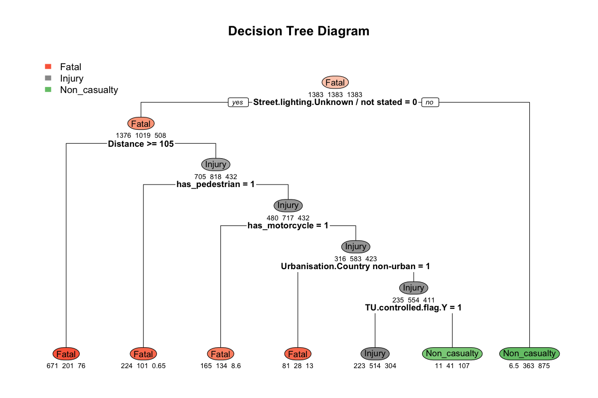
</div>
<div style="flex:0 0 47%; text-align:center;">
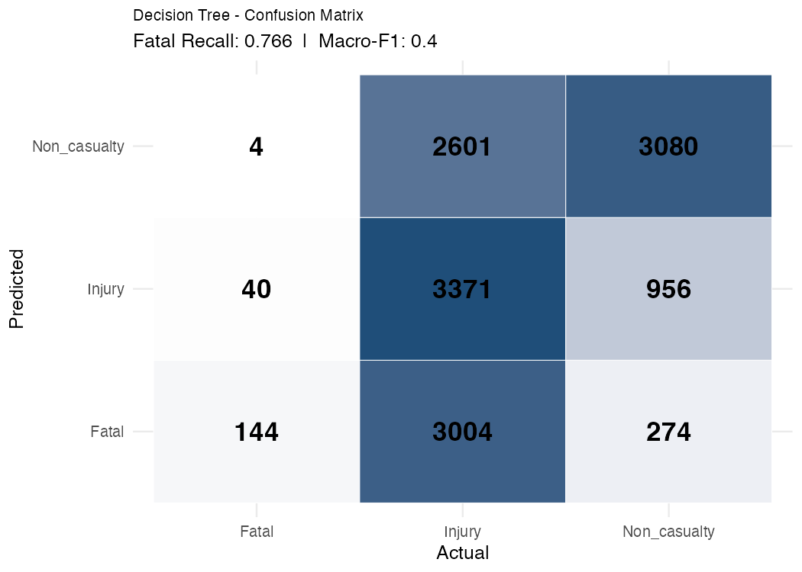

<table style="font-size:12px; width:90%; border-collapse:collapse; margin-top:6px; text-align:left;">
<thead><tr style="background:#2E74B5; color:white;">
  <th style="padding:4px 8px;color:white;">Metric</th><th style="padding:4px 8px;color:white; text-align:right;">Value</th>
</tr></thead>
<tbody>
  <tr><td style="padding:3px 8px;">Macro-F1</td><td style="padding:3px 8px; text-align:right;">0.4005</td></tr>
  <tr style="background:#f5f5f5;"><td style="padding:3px 8px; color:#d62728;"><b>Fatal Recall</b></td><td style="padding:3px 8px; text-align:right; color:#d62728;"><b>0.7660</b></td></tr>
  <tr><td style="padding:3px 8px;">Weighted F1</td><td style="padding:3px 8px; text-align:right;">0.5349</td></tr>
  <tr style="background:#f5f5f5;"><td style="padding:3px 8px;">Kappa</td><td style="padding:3px 8px; text-align:right;">0.2092</td></tr>
</tbody>
</table>

<p style="font-size:10.5px; text-align:left; margin:0; line-height:1.2; background:#f9f9f9; padding:6px; ">
  <b>Key message:</b> The tree identifies <b>Street Lighting</b> and <b>Distance</b> as the primary root splits. Using heavy class weights ensures the model actively searches for Fatal outcomes, satisfying safety constraints.
</p>
</div>
</div>

## Model Fitting: Random Forest


Random Forest was chosen as our **ensemble learner** - by averaging hundreds of decorrelated trees it reduces variance and handles the non-linear interactions between speed, location, and lighting that single trees miss. Built-in OOB error replaces CV, making it feasible on large data.

<div style="display:flex; align-items:flex-start; gap:16px;">
<div style="flex:0 0 52%;">
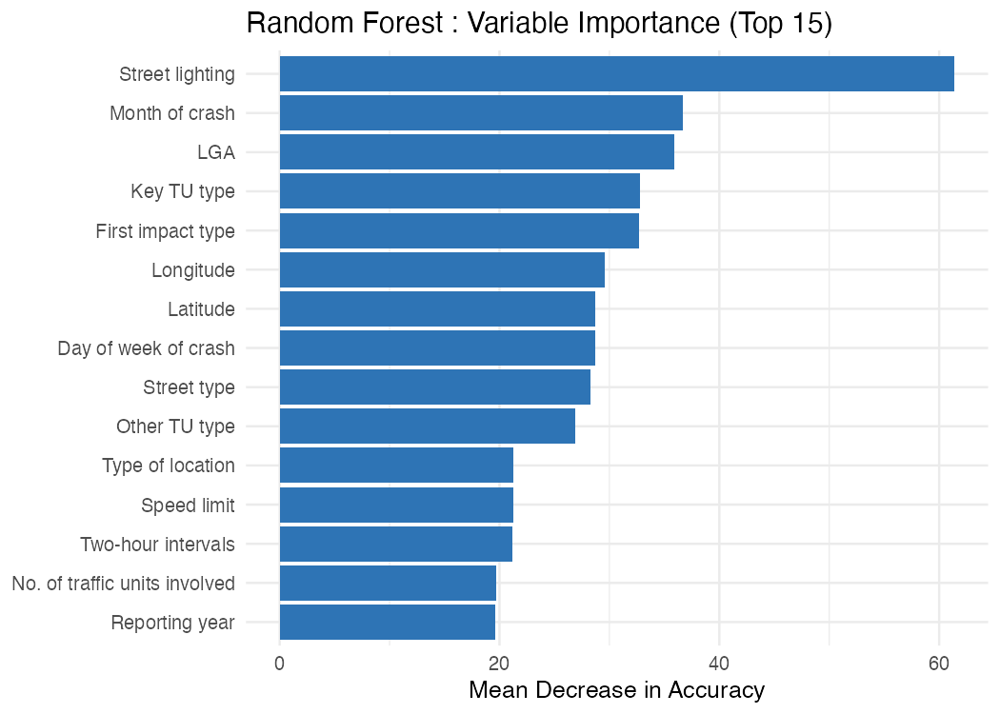
<p style="font-size:10.5px; text-align:left; margin-top:4px; line-height:1.3; background:#f9f9f9; padding:5px; width:100%;"><b>Top predictors (Mean Decrease Accuracy):</b> Street lighting, First impact type, Other TU type, Distance, Key TU type, Speed limit/speed_band, has_pedestrian - structural and environmental factors dominate. <i>Base model (pre-tuning) - mtry = 13 (tuned) shifts rankings slightly.</i></p>
</div>
<div style="flex:0 0 44%; text-align:center;">
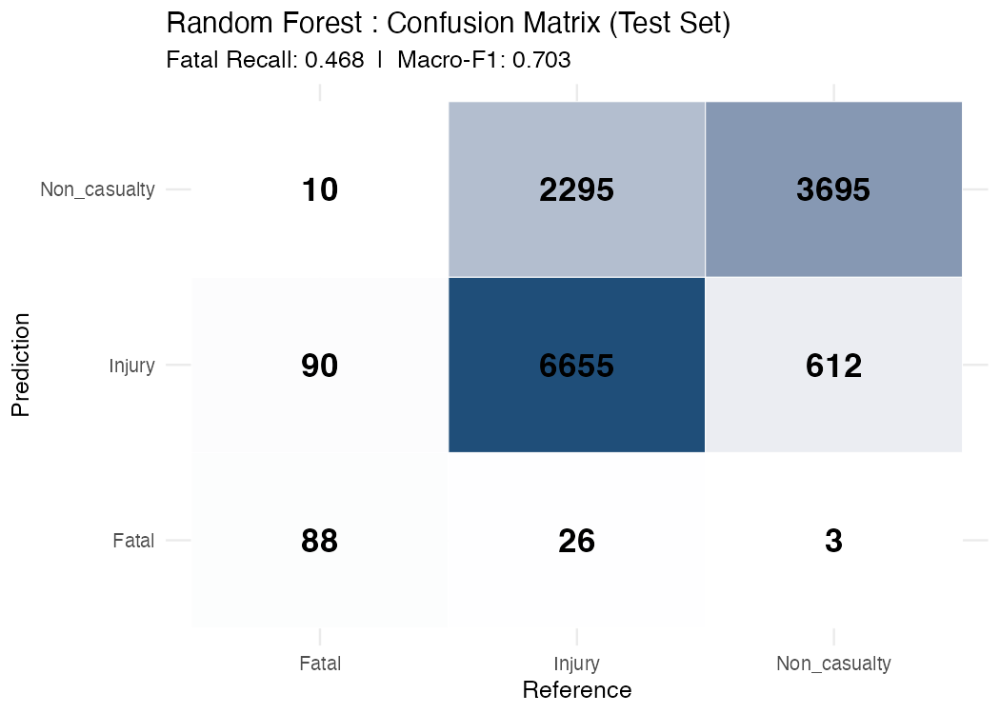
<table style="font-size:12px; width:100%; border-collapse:collapse; margin-top:6px; text-align:left;">
<thead><tr style="background:#2E74B5; color:white;">
  <th style="padding:4px 8px;color:white;">Metric</th><th style="padding:4px 8px;color:white; text-align:right;">Base (pre-tuning)</th>
</tr></thead>
<tbody>
  <tr><td style="padding:3px 8px;">OOB Error Rate</td><td style="padding:3px 8px; text-align:right;">22.85%</td></tr>
  <tr style="background:#f5f5f5;"><td style="padding:3px 8px;">Macro-F1</td><td style="padding:3px 8px; text-align:right;">0.7029</td></tr>
  <tr><td style="padding:3px 8px; color:#d62728;"><b>Fatal Recall</b></td><td style="padding:3px 8px; text-align:right; color:#d62728;"><b>0.4681</b></td></tr>
  <tr style="background:#f5f5f5;"><td style="padding:3px 8px;">Weighted F1</td><td style="padding:3px 8px; text-align:right;">0.7802</td></tr>
  <tr><td style="padding:3px 8px;">Kappa</td><td style="padding:3px 8px; text-align:right;">0.5436</td></tr>
</tbody>
</table>
</div>
</div>

## Model Fitting: XGBoost

XGBoost is a **boosting-based ensemble learner** that builds trees sequentially, each correcting the errors of the last. Fitted directly via `xgboost::xgb.train()` with inverse class weights to handle Fatal imbalance.

<div style="display:flex; align-items:flex-start; gap:16px;">

<div style="flex:0 0 52%;">
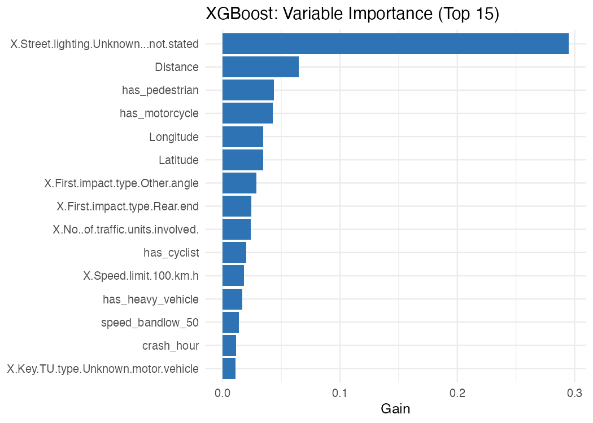

<p style="font-size:10.5px; text-align:left; margin-top:4px; line-height:1.3; background:#f9f9f9; padding:5px; width:100%;">
<b>Top predictors by Gain:</b> Street lighting (Unknown/not stated) dominates at 0.30 gain, nearly 5x the next predictor. Distance, pedestrian/motorcycle involvement, and Speed limit (100 km/h) follow.
</p>
</div>

<div style="flex:0 0 44%; text-align:center;">
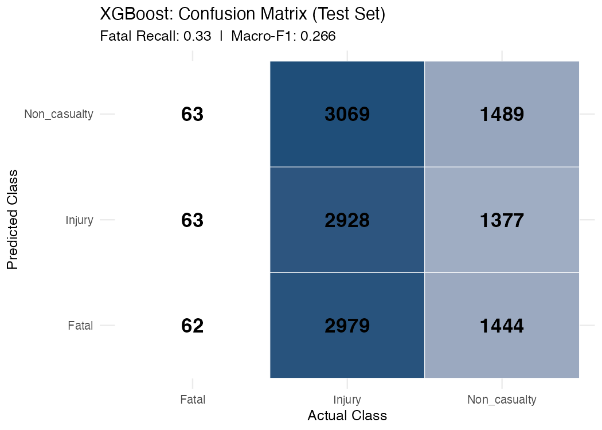

<table style="font-size:12px; width:100%; border-collapse:collapse; margin-top:6px; text-align:left;">
<thead>
<tr style="background:#2E74B5; color:white;">
  <th style="padding:4px 8px;color:white;">Metric</th>
  <th style="padding:4px 8px;color:white; text-align:right;">Value</th>
</tr>
</thead>

<!-- cat("Accuracy     :", round(accuracy_xgb, 3), "\n") -->

<!-- cat("Macro-F1     :", round(macro_f1_xgb, 3), "\n") -->

<!-- cat("Fatal Recall :", round(fatal_recall_xgb, 3), "\n") -->

<!-- cat("Weighted F1  :", round(weighted_f1_xgb, 3), "\n") -->

<!-- cat("Kappa        :", round(kappa_xgb, 3), "\n") -->

<tbody>
  <tr>
    <td style="padding:3px 8px;">Accuracy</td>
    <td style="padding:3px 8px; text-align:right;">0.332</td>
  </tr>

  <tr style="background:#f5f5f5;">
    <td style="padding:3px 8px;">Macro-F1</td>
    <td style="padding:3px 8px; text-align:right;">0.266</td>
  </tr>

  <tr>
    <td style="padding:3px 8px; color:#d62728;"><b>Fatal Recall</b></td>
    <td style="padding:3px 8px; text-align:right; color:#d62728;"><b>0.33</b></td>
  </tr>

  <tr style="background:#f5f5f5;">
    <td style="padding:3px 8px;">Weighted F1</td>
    <td style="padding:3px 8px; text-align:right;">0.399</td>
  </tr>

  <tr>
    <td style="padding:3px 8px;">Kappa</td>
    <td style="padding:3px 8px; text-align:right;">0.003</td>
  </tr>
</tbody>
</table>
</div>

</div>

<div style="font-size:12px; margin-top:10px; display:flex; gap:16px;">
<div style="background:#fce4e4; border-left:3px solid #d62728; padding:7px 12px; flex:1;">
<b>Performance Note:</b> Despite a grid search over nrounds, max_depth, and eta, XGBoost produced near-trivial predictions (Kappa = 0.003, Fatal Recall = 0.33). All configurations converged to the same 0.29-0.31 Macro-F1 band, suggesting sequential boosting did not interact well with inverse class weights on this dataset.
</div>
</div>

<!-- cat("Best nrounds:", best_xgb_params$nrounds, "\n") -->
<!-- cat("Best max_depth:", best_xgb_params$max_depth, "\n") -->
<!-- cat("Best eta:", best_xgb_params$eta, "\n") -->

<!-- if ("weight_power" %in% names(best_xgb_params)) { -->
<!--   cat("Best weight_power:", best_xgb_params$weight_power, "\n") -->
<!-- } -->

<!-- cat("Best validation Macro-F1:", round(best_xgb_params$Mean_F1, 3), "\n") -->
<!-- cat("Best validation Fatal Recall:", round(best_xgb_params$Fatal_Recall, 3), "\n") -->

<!-- if ("Tune_Score" %in% names(best_xgb_params)) { -->
<!--   cat("Best tuning score:", round(best_xgb_params$Tune_Score, 3), "\n") -->
<!-- } -->

## Model Fitting: KNN

<div style="display:flex; gap:22px; align-items:center; height:78vh;">

<div style="flex:0 0 40%; font-size:18px;">

**Model Overview**

- Instance-based: predicts by majority vote of k nearest neighbours

- No training phase; all computation happens at prediction time

- Features Z-score normalised within each CV fold

- Baseline to test: *do similar crash conditions share severity?*

<table style="font-size:15px; width:100%; border-collapse:collapse;">

<tr style="background:#2E74B5;">
  <th style="color:white; padding:4px 8px; text-align:left;">Metric</th>
  <th style="color:white; padding:4px 8px; text-align:right;">Value</th>
</tr>

<tr style="background:#f2f2f2;">
  <td style="padding:4px 8px;">Macro-F1</td>
  <td style="padding:4px 8px; text-align:right;">0.5304</td>
</tr>

<tr>
  <td style="padding:4px 8px; color:#d62728; font-weight:bold;">Fatal Recall</td>
  <td style="padding:4px 8px; text-align:right; color:#d62728; font-weight:bold;">0.5904</td>
</tr>

<tr style="background:#f2f2f2;">
  <td style="padding:4px 8px;">Weighted F1</td>
  <td style="padding:4px 8px; text-align:right;">0.6734</td>
</tr>

<tr>
  <td style="padding:4px 8px;">Kappa</td>
  <td style="padding:4px 8px; text-align:right;">0.3400</td>
</tr>

</table>

<div style="font-size:13px; margin-top:8px; display:flex; flex-direction:column; gap:6px;">
<div style="background:#eaf3fb; border-left:3px solid #2E74B5; padding:6px 10px;">
<b>Passes both gates:</b> Fatal Recall = 0.59 clears the 0.50 safety floor and Macro-F1 = 0.53 is competitive - but it sits 0.18 below Random Forest, with a Kappa gap of 0.21, meaning its class-level balance is substantially weaker.
</div>
<div style="background:#fff8e1; border-left:3px solid #f0ad4e; padding:6px 10px;">
<b>Structural limitation:</b> With p = 325 one-hot features, Euclidean distance conflates binary dummies with continuous distances - similar crash records are not truly "close" in this space, which caps KNN's ceiling regardless of k.
</div>
</div>

</div>

<div style="flex:0 0 58%;">
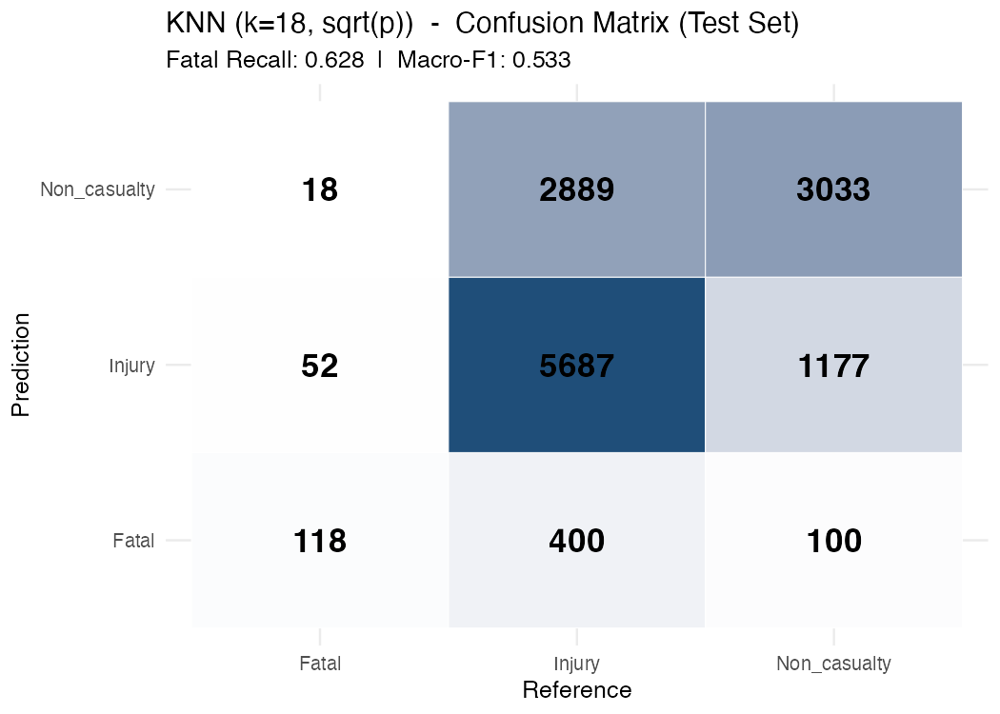
</div>

</div>

## Model Fitting: Naive Bayes

<div style="display:flex; gap:22px; align-items:center; height:78vh;">

<div style="flex:0 0 38%; font-size:18px;">

**Why Naive Bayes?**

- Probabilistic comparator model

- Suitable for categorical predictors  

- Fast to train on large data  

- Strong sensitivity to Fatal crashes

<table style="font-size:15px; width:100%; border-collapse:collapse; margin-top:6px;">

<tr style="background:#2E74B5;">
  <th style="color:white; padding:4px 8px; text-align:left;">Metric</th>
  <th style="color:white; padding:4px 8px; text-align:right;">Value</th>
</tr>

<tr style="background:#f2f2f2;">
  <td style="padding:4px 8px;">Macro-F1</td>
  <td style="padding:4px 8px; text-align:right;">0.243</td>
</tr>

<tr>
  <td style="padding:4px 8px; color:#d62728; font-weight:bold;">Fatal Recall</td>
  <td style="padding:4px 8px; text-align:right; color:#d62728; font-weight:bold;">0.771</td>
</tr>

<tr style="background:#f2f2f2;">
  <td style="padding:4px 8px;">Weighted F1</td>
  <td style="padding:4px 8px; text-align:right;">0.249</td>
</tr>

<tr>
  <td style="padding:4px 8px;">Kappa</td>
  <td style="padding:4px 8px; text-align:right;">0.112</td>
</tr>

</table>

<div style="font-size:13px; margin-top:8px; display:flex; flex-direction:column; gap:5px;">
<div style="background:#fce4e4; border-left:3px solid #d62728; padding:5px 10px;">
<b>Highest Fatal Recall (0.771) but extreme false alarms:</b> 4,133 of 8,976 actual Injury crashes predicted as Fatal (46%), collapsing Macro-F1 to 0.243 and Kappa to 0.112.
</div>
<div style="background:#fff8e1; border-left:3px solid #f0ad4e; padding:5px 10px;">
<b>Independence assumption fails:</b> Speed, lighting, and road type are correlated - NB cannot model their joint effects, forcing over-prediction of Fatal to compensate.
</div>
</div>

</div>

<div style="flex:0 0 60%; text-align:center;">

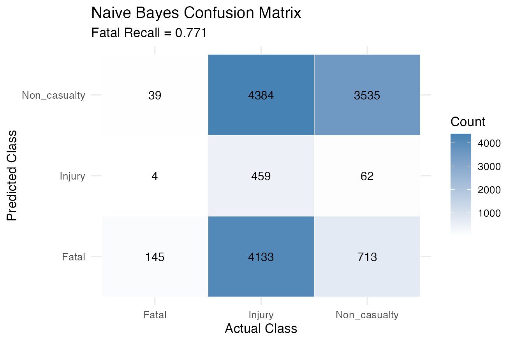

</div>

</div>

## Model Improvement: Hyperparameter Tuning


```{r slide-improvement}
tuning_tbl <- tibble::tibble(
  Model       = c("Logistic Regression", "Decision Tree", "Random Forest",
                  "XGBoost", "KNN", "Naive Bayes"),
  Parameter   = c("decay", "cp (complexity)", "mtry",
                  "nrounds / max_depth / eta", "k (neighbours)", "usekernel / laplace"),
  `Search Range` = c("0 to 0.1",
                     "xerror minimisation",
                     "tuneRF: 4, 6, 9, 13",
                     "100-500 / 3-6 / 0.03-0.3",
                     "k = round(sqrt(p))",
                     "kernel: F / laplace: 0, 0.5, 1"),
  `Best Value`       = c("decay = 0.001", "cp = 0.001", "mtry = 13", "best grid point", "k = 18", "laplace = 0"),
  `Macro-F1 (Base / Tuned)`     = c("0.4446 / 0.4442", "0.4005 / 0.4369", "0.7029 / 0.7079",
                                      "0.266 / 0.267",  "0.5304 / 0.5304", "0.243 / 0.245"),
  `Fatal Recall (Base / Tuned)` = c("0.7660 / 0.7553", "0.7660 / 0.8138", "0.4681 / 0.5106",
                                      "0.33 / 0.34",    "0.5904 / 0.5904", "0.771 / 0.782"),
)

kable(tuning_tbl, booktabs = TRUE) %>%
  kable_styling(full_width = TRUE, font_size = 12) %>%
  row_spec(0, bold = TRUE, background = "#2E74B5", color = "white") %>%
  row_spec(3, background = "#eaf3fb") %>%
  column_spec(1, bold = TRUE)
```

> RF: `tuneRF` identified **mtry = 13** (default = 6) - Fatal Recall climbed from **0.4681 to 0.5106**, crossing the 0.50 safety constraint (Macro-F1 +0.005). DT: pruning at **cp = 0.001** lifted Fatal Recall from **0.7660 to 0.8138** with Macro-F1 +0.036.

<div style="font-size:13px; margin-top:10px; display:flex; gap:20px;">

<div style="background:#f0faf0; border-left:3px solid #2ca02c; padding:7px 12px; flex:1;">
**Where tuning paid off:** DT and RF gained the most. Pruning at `cp = 0.001` let the tree grow deep enough to isolate Fatal regions, lifting **both** Macro-F1 (+0.036) **and** Fatal Recall (+0.048). RF's larger `mtry = 13` forced each split to consider more candidate variables, breaking the dominance of Injury-associated features and pushing Fatal Recall across the 0.50 safety threshold.
</div>

<div style="background:#fff8e1; border-left:3px solid #ff9800; padding:7px 12px; flex:1;">
**Where tuning barely moved the needle:** LR (decay), XGBoost (depth/eta/rounds), and NB (laplace) each shifted Macro-F1 by less than ±0.005. This suggests the baseline configurations already sit close to each model's capacity on this feature set - further gains require **structural changes** (e.g., richer encoding, calibrated thresholds, different model class), not more tuning.
</div>

<div style="background:#eaf3fb; border-left:3px solid #2E74B5; padding:7px 12px; flex:1;">
**Methodology note:** All tuning was driven by cross-validated **Macro-F1** (or logLoss for NB), never by Fatal Recall directly. Fatal Recall ≥ 0.50 is treated as a **hard post-hoc constraint** rather than an optimisation target - this avoids inflating Fatal Recall at the cost of collapsing precision on the other two classes.
</div>

</div>

## Model Evaluation

<p style="font-size:14px; margin-bottom:6px; background:#eaf3fb; padding:7px 14px; border-left:4px solid #2E74B5; display:inline-block; width:96%;">
<b>Selection criteria:</b> Primary metric = <b>Macro-F1</b> (robust to class imbalance) &nbsp;|&nbsp; Hard constraint = <b>Fatal Recall ≥ 0.50</b> (safety floor: models below this are eliminated regardless of other metrics)
</p>

```{r slide-evaluation}
eval_tbl <- tibble::tibble(
  Model          = c("Logistic Regression (tuned)", "Decision Tree (tuned)", "Random Forest (tuned)",
                     "XGBoost (tuned)", "KNN (k = 18)", "Naive Bayes (tuned)"),
  `Macro-F1`     = c("0.4442", "0.4369", "0.7079", "0.267", "0.5304", "0.245"),
  `Fatal Recall` = c("0.7553", "0.8138", "0.5106", "0.34",  "0.5904", "0.782"),
  `Weighted F1`  = c("0.5987", "0.5854", "0.7817", "0.401", "0.6734", "0.253"),
  `Kappa`        = c("0.2821", "0.2755", "0.5473", "0.004", "0.3400", "0.112"),
  `Meets Fatal Recall >= 0.50` = c("Yes", "Yes", "Yes", "No", "Yes", "Yes")
)

kable(eval_tbl, booktabs = TRUE, escape = FALSE) %>%
  kable_styling(full_width = TRUE, font_size = 13) %>%
  row_spec(0, bold = TRUE, background = "#2E74B5", color = "white") %>%
  row_spec(3, background = "#eaf3fb", bold = TRUE) %>%
  column_spec(1, bold = TRUE) %>%
  column_spec(3, color = "#d62728")
```

> **Random Forest (tuned)** is the only model with Macro-F1 > 0.55 that *also* satisfies Fatal Recall >= 0.50. LR/DT have higher Fatal Recall (>0.75) but Macro-F1 < 0.45 - too many false alarms. XGBoost fails the safety floor. NB matches LR's Fatal Recall but Macro-F1 < 0.25.

<div style="font-size:13px; margin-top:10px; display:flex; gap:20px;">

<div style="background:#fce4e4; border-left:3px solid #d62728; padding:7px 12px; flex:1;">
**Eliminated by the safety floor:** XGBoost is the only model below the hard constraint (Fatal Recall = 0.34 < 0.50). Despite extensive grid search, its weighted-loss configuration converged to a near-trivial classifier - Kappa ≈ 0.004 indicates predictions are barely better than random for this multi-class task.
</div>

<div style="background:#fff8e1; border-left:3px solid #ff9800; padding:7px 12px; flex:1;">
**Pass the floor, but Macro-F1 too low:** LR, DT, and NB all clear Fatal Recall > 0.75 but stay below Macro-F1 = 0.45 - they detect fatals aggressively at the cost of precision on Injury and Non-casualty. Useful as high-recall safety nets, but not balanced enough as primary classifiers.
</div>

<div style="background:#f0faf0; border-left:3px solid #2ca02c; padding:7px 12px; flex:1;">
**Pass both gates - the shortlist:** Only KNN (Macro-F1 = 0.5304) and RF (Macro-F1 = 0.7079) clear *both* thresholds. RF leads KNN by **+0.18 Macro-F1**, with consistent gaps on Weighted F1 (+0.11) and Kappa (+0.21) - the ranking is robust across all four metrics, not a single-metric artefact.
</div>

</div>

## Model Selection

<div style="display:flex; gap:24px; align-items:flex-start;">

<div style="flex:0 0 52%; font-size:14px;">

<p style="font-size:20px; font-weight:bold; color:#2ca02c; margin-bottom:4px;">Winner: Random Forest (tuned, mtry = 13)</p>

Only model that simultaneously:

- Achieves the **highest Macro-F1 (0.7079)** across all six models
- Achieves the **highest Weighted F1 (0.7817)** and **Kappa (0.5473)**
- **Satisfies the hard Fatal Recall constraint (0.5106 >= 0.50)**

<p style="font-size:14px; font-weight:bold; margin-top:10px; margin-bottom:4px;">Why not the other models?</p>

<ul style="font-size:13px; line-height:1.8;">
  <li><b>XGBoost:</b> Fatal Recall = 0.34, fails the 0.50 safety floor outright</li>
  <li><b>Logistic Regression:</b> Fatal Recall = 0.75 but Macro-F1 = 0.44, too many false alarms across other classes</li>
  <li><b>Naive Bayes:</b> Fatal Recall = 0.78 but Macro-F1 = 0.24, collapses precision on Injury and Non-casualty</li>
  <li><b>Decision Tree:</b> Fatal Recall = 0.81 but Macro-F1 = 0.44, high recall comes at severe precision cost</li>
  <li><b>KNN:</b> Passes both gates but Macro-F1 = 0.53, which is 0.18 behind RF with a Kappa gap of 0.21 across all metrics</li>
</ul>

</div>

<div style="flex:0 0 44%; font-size:13px;">

**Top predictors (RF Variable Importance):**

| Rank | Feature |
|:---|:---|
| 1 | Street lighting |
| 2 | First impact type |
| 3 | Other TU type |
| 4 | Distance |
| 5 | Key TU type |
| 6 | Speed limit / `speed_band` |
| 7 | `has_pedestrian` |

<p style="font-size:12px; background:#eaf3fb; padding:6px; border-left:3px solid #2E74B5; margin-top:6px;">
Structural & environmental factors dominate over temporal ones - aligning with the EDA finding that 110 km/h + Darkness + Country non-urban scenarios drive ~5x baseline Fatal risk.
</p>

</div>

</div>

## Final Results & Conclusion

<div style="display:flex; gap:24px; align-items:flex-start;">

<div style="flex:0 0 50%; font-size:14px;">

**Research Question - Answered:**

- **Yes** - environmental and traffic-unit conditions can predict 3-class crash severity
- Tuned Random Forest achieves **Macro-F1 = 0.7079**, the highest across all six models
- Correctly flags **51% of Fatal crashes** on the 2020-2023 test set (10% stratified split)
- OOB error rate of **22.85%**; generalisation to unseen 2024 data is evaluated on the next slide

**Key Findings:**

- **Speed band, street lighting, and impact type** are the strongest predictors - mirroring EDA
- Class imbalance handling matters more than algorithm choice: undersampling + class weights lifted Fatal Recall from ~0 (naive) to 0.51 on RF
- **Pedestrian and motorcycle involvement** are top binary flags for fatal outcomes
- Tree ensembles dominate parametric and instance-based models on this problem

</div>

<div style="flex:0 0 47%; font-size:13px;">

**Practical implications:**

| Stakeholder | Action |
|:---|:---|
| **Traffic Authorities** | Target lighting upgrades + speed reviews on 90-110 km/h rural corridors flagged by the model |
| **Emergency Responders** | Use the model's Fatal probability score to pre-allocate trauma resources before scene arrival |
| **Policymakers** | Evidence for stricter rural-night-speed policy; quantified marginal risk of pedestrian + heavy-vehicle interactions |
| **Insurers** | Inputs for granular, condition-aware risk pricing |

<p style="font-size:12px; background:#f0faf0; padding:6px; border-left:3px solid #2ca02c; margin-top:6px;">
The 0.7079 Macro-F1 is the highest among the six candidates while still meeting the safety-first 0.50 Fatal Recall floor - a balance no other model achieved.
</p>

</div>
</div>

## Final Model Performance & Reflection

<div style="display:flex; gap:24px; align-items:flex-start;">

<!-- LEFT SIDE -->
<div class="slide21-left" style="flex:0 0 44%; font-size:13px;">

<p style="font-size:15px; font-weight:bold; margin-bottom:4px; color:#1F4E79;">Final Model Performance: 2024 Temporal Holdout</p>

<p style="font-size:12px; line-height:1.4; margin-bottom:6px;">2024 data sealed as an unseen <b>temporal holdout</b> (~35,000 records, natural ~1.4% Fatal) - compare to the test set (~13,500 records, ~6% Fatal after undersampling).</p>

<table style="font-size:13px; width:100%; border-collapse:collapse; margin-bottom:8px;">
<thead>
<tr style="background:#2E74B5;">
  <th style="color:white; padding:4px 8px; text-align:left;">Metric</th>
  <th style="color:white; padding:4px 8px; text-align:center;">Test Set</th>
  <th style="color:white; padding:4px 8px; text-align:center;">2024 Holdout</th>
</tr>
</thead>
<tbody>
<tr style="background:#f2f2f2;">
  <td style="padding:4px 8px;">Macro-F1</td>
  <td style="padding:4px 8px; text-align:center;">0.7079</td>
  <td style="padding:4px 8px; text-align:center;">0.334</td>
</tr>
<tr>
  <td style="padding:4px 8px; color:#d62728; font-weight:bold;">Fatal Recall</td>
  <td style="padding:4px 8px; text-align:center; color:#d62728; font-weight:bold;">0.5106</td>
  <td style="padding:4px 8px; text-align:center; color:#d62728; font-weight:bold;">0.106</td>
</tr>
<tr style="background:#f2f2f2;">
  <td style="padding:4px 8px;">Weighted F1</td>
  <td style="padding:4px 8px; text-align:center;">0.7817</td>
  <td style="padding:4px 8px; text-align:center;">0.572</td>
</tr>
<tr>
  <td style="padding:4px 8px;">Kappa</td>
  <td style="padding:4px 8px; text-align:center;">0.5473</td>
  <td style="padding:4px 8px; text-align:center;">0.037</td>
</tr>
</tbody>
</table>

<p style="font-size:15px; font-weight:bold; margin-bottom:4px; color:#1F4E79;">Reflection</p>

<ul style="font-size:12px; line-height:1.5; margin-top:0; padding-left:16px;">
<li><b>Fatal Recall: 0.51 (test) to 0.106 (holdout)</b> - two compounding causes:</li>
<li><b>Class-proportion mismatch:</b> Model trained at ~6% Fatal; holdout is ~1.4% - a 4x rarer signal it is not calibrated for</li>
<li><b>Temporal drift:</b> 2024 patterns may differ from the 2020-2023 training window</li>
<li>Strong test-set metrics do not guarantee deployment robustness for rare, high-consequence events</li>
</ul>

</div>

<!-- RIGHT SIDE -->
<div style="flex:0 0 56%; text-align:center;">

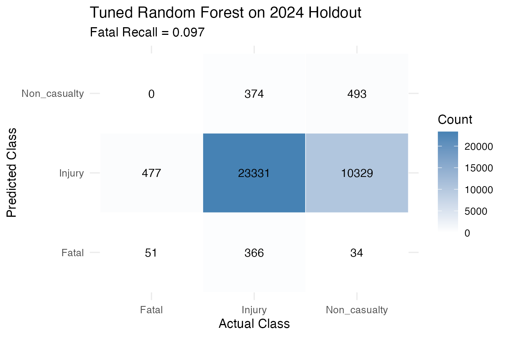

<p style="font-size:12px; color:#111; margin-top:6px; background:#fce4e4; border-left:3px solid #d62728; padding:6px; text-align:left;">
Of 528 actual Fatal crashes in the 2024 holdout, only <b>56 were correctly identified</b>; the remaining 472 were predicted as Injury. The model reverts to predicting the majority class when the minority is as rare as 1.4%, reinforcing the need for probability-threshold calibration or a dedicated rare-event model in production.
</p>

</div>

</div>

